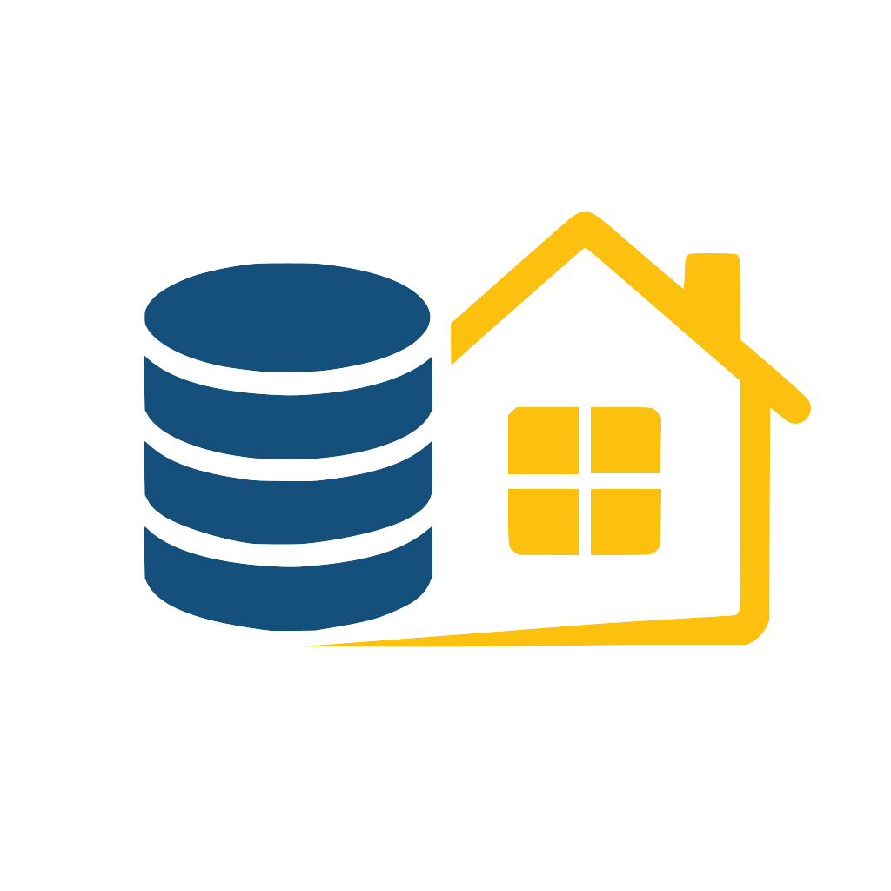

# GestioLan #
*Gestionale Casalingo Progettato per girare in LAN*


Questo progetto consiste in un gestionale il cui scopo è quello di essere totalmente autosufficiente nella rete Lan.
questo gestionale puo usare piccoli servizi da internet il cui scopo è principalmente migliorare la user experience principalmente per il fetching di immagini (ma non indispensabili).
per una documentazione piu completa, guardare in `/Docs`.
<br clear="left">

> /Docs è consigliato aprirla con Obsidian per una maggiore chiarezza sulle canvas

Se voleste supportare il progetto, potete farlo qui ^^
[Buy me a Coffee](https://buymeacoffee.com/cookiemaker)

## Come istanziare questo gestionale? 
- Usando Docker 
- Eseguendo i componenti singolarmente e compilandoli in locale (Sconsigliato)

### Con docker
Per usare il databse e l'api con docker basterà seguire questi step:
- (Opzionale) copiare la cartella `Docker` nella  directory che preferisci della macchina in cui gireranno i container
- Entrare nella cartella `Docker` e creare un file chiamato esattamente `.env`
- copiare in `.env` il contenuto di `ENV_template.txt` e sostituire i valori mancanti
- aprire il terminale ed entrare nella cartella `Docker`
- scrivere nel terminale questo comando:
```Bash
docker compose up -d
```
se volete buildare i container da codice sorgente allora:
```Bash
docker compose -f docker-compose-build.yaml up --build
```

#### Struttura dati
personalmente mi trovo meglio a lavorare con docker usando i bind mount, per come ho creato il docker compose esso ha questa gerarchia (partendo da root)
```Plaintext
/docker/
├── compose-files/           # Qui risiedono i file di configurazione
│   ├── gestiolan/           
│   ├────── docker-compose.yaml
│   ├────── .env
└── services/                # Qui risiedono i dati dei container (Volume Mapping)
    ├── gestiolan/
    │   ├── uploads/items
    │   ├── uploads/users
    │   ├── Containers_logs/GestioLan.API
    │   └── gestiolan-mysql
    └── *otherServices*/
        └── *otherStuff*/
```
consiglio di usare la stessa struttura, anche perchè in questa maniera è piu comodo spostare i dati da un posto all'altro, oppure effettuare backup. 
Altrimenti potete sempre modificare il file docker-compose.yaml e gestire i volumi come piu volete, è solo questione di cambiare qualche riga di configurazione

### Senza docker
non so perche tu stia facendo questa scelta, ma per eseguire il sistema senza docker hai bisogno di entrare nella cartella `src/GestioLan.API` e modificare il file `appsettings.json` con i rispettivi valori delle variabili d'ambiente, oppure creare degli user secret in questa maniera:
```Bash
dotnet user-secrets set "GestioLANConnection" "Server=IP_ADDRESS;Database=GestioLAN;User=YOUR_USER;Password=YOUR_PASSWORD;"
```

- Server      : è l'ip della macchina che fa girare il server MySQL 
- Database    : Nome del database
- User Id     : Utente di MySQL / mariadb
- Password    : Password di MySQL / mariadb
(per userid, nel database è meglio creare un utente NON root, il cui scopo è soltanto interagire con questo database)

fare lo stesso per tutte le altre variabili, e scrivere nel file `src/GestioLan.API/GestioLan.API.csproj`
```plaintext
<UserSecretsId>6cbfc2bf-486c-4984-95b0-9e012edb0747</UserSecretsId>
```
per ciascun usersecret creato, e inserire tra i tag, i rispettivi codici generati.
> NOTA
> il codice all'interno dei tag si riferisce al secret che si trova nella macchina in cui gira il codice,
> quindi questo lavoro va fatto se si cambia macchina su cui gira l'api
successivamente esegui questo comando:
```Bash
dotnet run
```
Lo stesso lavoro andrà fatto per avviare anche gli altri servizi (che sono ancora in sviluppo)

se questo backend lo esegui sulla tua macchina, dovrai digitare questo nel bowser:
```Plaintext
localhost:5069/swagger/index.html
```
*/swagger/index.html se sei in Developement mode, e vuoi testare l api da browser*

## IMPORTANTE
normalmente i due container del database e dell api vengono aggiornati in maniera parallela per evitare di avere inconsistenze, se pero tuttavia, per qualche motivo particolare, decidete di usare l'api con container di mariadb totalmente vergine, se l'api è in modalita Developement, essa aggiornerà il database alle ultime migrazioni.


## Feature da sviluppare in futuro ##
- Un idea futura, sarà quella di creare un automazione (magari per n8n) he esegue periodicamente delle query al DB (secondo certi criteri scelti dall'utente)
e manda (tramite bot telegram per esempio) dei messaggi con delle informazioni
*può essere utile per esempio, per sapere se delle scorte di cibo stanno finendo, quindi avere una lista di cose da comprare*

- Creare delle integrazioni per l'AI in locale o cloud (priorita a modelli locali come Ollama)

- Creare un MCP server come client,cosi da poter integrare delle interazioni con degli LLM
    - OUTPUT: un LLM puo fare delle query e in base al contenuto del database, fare delle computazioni 
        - ( es: "consigliamo cosa preparare per cena usando gli alimenti che ho in casa" )
        - ( es: "stampa su un foglio la lista della spesa da fare")
    - INPUT: un LLM puo aggiungere in maniera smart, item nel database, passandogli lo scontrino della spesa, in modo da poter categorizzare gli oggetti nuovi e inserirli correttamente! 

- Attualmente come client sono in sviluppo la versione [GestioLAN - Desktop & mobile](https://github.com/CookieMaker443/GestioLAN-Desktop), l idea è quella di creare anche una versione WebApp

- creare un interfaccia per permette la creazione modulare di plugin per il fetching di immagini da diverse api pubbliche (ciascuna con la loro logica) e permettere al backend di rilevare questi plugin senza ricompilare il programma (usando la riflessione).

- Creare un sistema di Log per permettere di tenere traccia di tutte le azioni eseguite, tentativi di esecuzioni ed erriri vari, differenziando l'origine di tali richieste (se un utente, un AI con MCP, o un potenziare bypass da qualche hacker), usando anche il JWT per l'identificazione

## Tecnologie utilizzate
- Mariadb 11.6.0
- Runtime dotnet 8.0

- BCrypt 4.0.3
- JwtBearer 8.0

- Claude e Gemini come assistente AI per brainstormin, info su librerie(anche nella repo dei client desktop/mobile)
- Codellama:7b per aiuto nella formattazione della documentazione ed eventuali traduzioni (anche nella repo dei client desktop/mobile)

## API esterne open source usate per le immagini (ancora work in progress)
- OpenFoodFacts